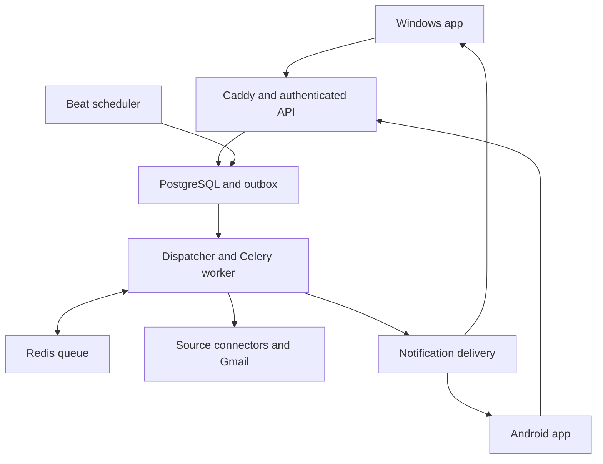

# Personal Staffer — Complete Build Specification

Version 1.0 • September 12, 2026 • Standalone implementation handoff

This file contains the product requirements, implementation defaults, architecture, contracts, delivery order, validation requirements and handoff instructions for building Personal Staffer. The receiving engineering agent does not need the original conversation or another attachment. This specification describes intended software, not an already implemented or tested application.

**01. Instructions for the receiving engineering agent**

Act as the implementation engineer for this project. Read the entire specification before coding. Build the application incrementally and validate each increment. Do not merely summarize this file, generate another proposal, or stop after producing a scaffold or a mock interface.

The repository supplied by the user is https://github.com/msaiabhinav/Personal-Staffer. First inspect the available workspace, repository, README, existing implementation, local instructions and Git status. Preserve unrelated work. Use a feature branch such as feature/personal-staffer-core; use the user's existing active branch if instructed. This handoff does not itself authorize publishing, production deployment, merging or sending communications. Follow the user's execution-time permissions. Do not assume the repository is accessible. If access is unavailable, prepare the implementation in a clearly named local Git project and report how to transfer it; do not claim to have modified the remote repository.

Treat explicit user requirements in this file as the product contract. Implementation defaults below fill gaps and can be implemented without repeatedly asking routine questions. Later explicit user instructions supersede this document. Record material technical deviations in an architecture decision record, with reason and effect on requirements. Do not change hard eligibility rules, replace the installed product with a website, or remove a requested feature to simplify implementation.

At the beginning, create docs/BUILD_STATUS.md with a requirement-to-code/test matrix, milestone state, dependency blockers, verified capabilities and the next executable task. Update it as work proceeds. If context or session limits interrupt implementation, leave buildable work, exact commands and a continuation checkpoint. Continue from that checkpoint rather than recreating the project.

When a credential or external service is unavailable, implement the integration boundary, configuration validation, deterministic contract tests and a clear NOT_CONFIGURED state. Continue independent work. Ask only for the missing input needed to activate the integration; never request passwords, session cookies or broad account access in chat. An unconfigured connector or placeholder is not a completed live integration. Mark tests as executed, failed or not run with reasons. Do not claim Windows or Samsung testing from Linux-only checks.

Use current official documentation to verify package/API compatibility at build time. Pin tested dependency versions and commit lockfiles. Do not blindly freeze a historical version from this document. No paid subscription, public deployment or external message should be initiated without applicable authorization.

**02. Product identity, user and scope**

Product name: Personal Staffer. A private, single-user job-discovery and application-tracking application with an installed Windows client and an installed Android client. Windows is the first usable delivery; Samsung Android is included in the full build scope and shares the backend. There is no requirement for a browser product, iPhone app or public multi-user SaaS.

User-provided target hardware: Asus Vivobook Pro 15, 24 GB RAM, 2 TB SSD, Intel Ultra 9, NVIDIA RTX 3050 with 6 GB VRAM; Samsung Galaxy S25 Ultra. Do not substitute devices from unrelated personal history. Confirm actual Windows/Android versions during device setup. Cloud background work must continue when either device is asleep, off or disconnected. Linux VPS hosting is the baseline; OVH is the current candidate, with actual availability and capacity to be checked. The laptop GPU is optional for development experiments and is never an always-on dependency.

The application searches only U.S. jobs. Gmail is the selected email provider. A resume is neither required nor part of onboarding. Job relevance comes from saved titles and skills. Do not add resume upload/extraction, auto-application, LinkedIn login, LinkedIn job sourcing, automatic connection requests or automatic message sending. Personalized LinkedIn draft generation and a dedicated networking-status tracker are deferred product ideas; current People functionality is discovery and public profile links.

The daily goal is up to 50 new qualifying jobs at 11:00 AM Eastern. Never weaken hard rules to meet 50. The product must distinguish fewer qualifying results from a partially failed search. Priority jobs are additional and must pass the same eligibility rules.

**03. Requirement register**

Use these identifiers in implementation status and acceptance tests.

| ID | Requirement |
|---|---|
| PR-01 | Installed Windows and Android clients; shared cloud state; Windows first. |
| PR-02 | Single-user identity; no resume required; Gmail selected. |
| PR-03 | U.S. jobs, remote/hybrid/onsite, role-family and skill-based discovery. |
| PR-04 | Complete JD, confirmed full-time, verified freshness within 72 hours. |
| PR-05 | Confirmed E-Verify legal employer; unknown employers withheld. |
| PR-06 | Exclude explicit sponsorship restrictions; unstated sponsorship permitted. |
| PR-07 | Exclude required clearance; preferred-only clearance flagged. |
| PR-08 | Exactly four years allowed; 4+ and higher required experience excluded. |
| PR-09 | $80K preference, undisclosed eligible, lower compensation may fill slots. |
| PR-10 | Daily maximum 50; newest-first display; at most two jobs per company. |
| PR-11 | Shared 32-day employer rotation; permanent duplicate/repost suppression. |
| PR-12 | Priority watchlist, university and Connecticut alerts, independent of daily quota/rotation. |
| PR-13 | Dedicated NYC and Bay Area startup discovery pools. |
| PR-14 | JobSpy excluding LinkedIn plus direct employer, ATS and specialized sources. |
| PR-15 | Full job details, evidence, source links and original application destination. |
| PR-16 | Up to ten relevant public LinkedIn people per job; relationship evidence; no ranking. |
| PR-17 | Exact five-item navigation and Homepage's two tabs. |
| PR-18 | Saved jobs persist until applied or unsaved; no age-based removal. |
| PR-19 | Permanent applications, snapshots, source links and event history. |
| PR-20 | Accidental Applied and automatic status changes can be corrected; prior state restored appropriately. |
| PR-21 | Gmail-driven application dashboard, review of ambiguous updates and source evidence. |
| PR-22 | Clickable notifications navigate to the specific destination; persistent inbox and unread count. |
| PR-23 | Cross-device sync, explicit pending states and conflict-safe offline actions. |
| PR-24 | Search-run history, source health and explainable inclusion/withholding. |
| PR-25 | Authentication, secure storage, backups, restore, installation and update instructions. |

**04. Initial search profile**

Normalize spelling while preserving the user's original configurable vocabulary. Match role responsibilities as well as titles; do not require every saved skill.

| Family | Initial examples |
|---|---|
| Data analysis | Data Analyst with meaningful modifiers: healthcare, finance, product, sales, marketing, supply chain, research, customer, operations. |
| Business analysis | Business Analyst, Business Systems Analyst, AI Business Analyst, technical/business process analyst where duties match. |
| Business intelligence | Business Intelligence Analyst, BI Analyst, Reporting Analyst, Insights Analyst. |
| Operations and revenue | Operations Analyst, Sales Analyst, Revenue Analyst, Revenue Operations Analyst, Growth Analyst, analytics-oriented Business Operations and Strategy/Operations roles. |
| AI and machine learning | AI Analyst, AI Engineer, Machine Learning Analyst/Engineer, analytics-oriented AI Solutions Engineer. |
| Analytics engineering | Analytics Engineer, Data Analytics Engineer and closely related analytical data-modeling roles. |
| Deployment | Forward Deployed Engineer, Forward Deployment Engineer, Forward Deployed AI Engineer, relevant Deployment Strategist. |
| Domain analysis | Healthcare, supply chain, financial, institutional research, research data, enrollment/student success and university healthcare analytics. |

Startup examples include Founding Data Analyst and Product Analyst when actual responsibilities qualify. Broad words such as AI, Healthcare, Supply Chain or Data alone must not admit unrelated roles. Senior/Lead titles are not automatically disqualifying; actual experience requirements and responsibilities control eligibility. Unrelated teaching, faculty and postdoctoral jobs are excluded.

Canonical skill vocabulary: SQL; Power BI (including PowerBI and the input spelling PowwerBI); Python; Excel; machine learning; Snowflake; AI/artificial intelligence; LLMs/large language models; forecasting; business analysis; Tableau; Excel lookup functions such as VLOOKUP/XLOOKUP; Qlik; pandas; Databricks; statistics; data analysis. Maintain aliases and closely related technologies in versioned configuration. Distinguish direct matches from related technologies; never imply the user possesses every related skill. Missing requested skills are informational unless the user later makes a skill mandatory.

Initial preferences: USA, all three work arrangements, annual USD $80,000 preferred, salary undisclosed allowed, lower salary permitted to fill the batch. No relocation, education or personal-profile assumptions beyond this file. General U.S. remote jobs can qualify nationwide; Connecticut priority treatment is narrower, as specified below.

**05. Hard eligibility and uncertainty contract**

Represent extracted facts independently from decisions. A fact can be KNOWN, NOT_STATED, UNKNOWN or CONFLICTING. Each rule returns PASS, FAIL, UNKNOWN or REVIEW, a reason code, evidence references and rule version. Final evaluation is ELIGIBLE, INELIGIBLE or NEEDS_REVIEW. A PASS may mean an exclusion was not detected in complete evidence; it does not imply the employer affirmatively guarantees the condition.

Rules with a mandatory positive fact (country, employment type, freshness, legal employer/E-Verify, active opening and interpretable required experience) must withhold a job when required evidence is missing. Sponsorship and clearance use exclusion-based policy: silence in a complete successfully retrieved JD does not itself reject. Failed or incomplete retrieval is never equivalent to silence.

| Rule | Required behavior |
|---|---|
| Country | Confirm a U.S. workplace or explicit eligibility for U.S. remote work. “Remote” without geography is insufficient. Global remote can qualify if U.S. hiring is explicitly supported. |
| Employment | Full-time must be established by credible structured data or unambiguous JD. Exclude contract, contract-to-hire, temporary, part-time, seasonal, internship, per-diem, freelance and consulting engagements. A title at a consulting company is not itself an excluded engagement. Conflicting “full-time” metadata and contract JD fails the employment gate. |
| Staffing | Permit only permanent full-time placements. Verify the actual employing/payroll organization; do not use a client's E-Verify participation for an unrelated staffing employer. |
| Sponsorship | Exclude explicit no sponsorship now/future, no visa transfers, only citizens/permanent residents, permanent unrestricted authorization, or explicit OPT/STEM OPT/CPT/visa-candidate ineligibility. Ordinary “authorized to work in the U.S.” without an exclusion is not automatically a prohibition. Label stated availability AVAILABLE, silence NOT_STATED; resolve conflicting statements conservatively. |
| Clearance | Exclude required Confidential, Secret, Top Secret, SCI/TS-SCI, DoD, DOE Q/L, Public Trust/government suitability clearance, current clearance, or ability to obtain/maintain clearance. Identify negation: “no clearance required” passes. Preferred-only clearance may pass with a flag. Routine background/drug/identity checks alone do not fail. |
| E-Verify | Confirm the matched legal entity, evidence source and check date. No approval based on fuzzy brand name, unrelated parent/subsidiary or old unsupported label. Unknown and conflicting identity are withheld. A search miss is UNKNOWN, not proof of nonparticipation. |
| Role relevance | Match approved families and substantive duties. Titles alone or incidental keywords are insufficient. Store reasons and distinguish required from preferred skills. |
| Active opening | Verify the particular job still has an actionable application path and is not explicitly closed. HTTP 200 is not sufficient. Temporary block/error creates UNKNOWN rather than CLOSED. |

Experience implementation defaults below clarify cases not individually decided in the conversation. Keep these in policy configuration with tests; never silently reinterpret them. They deliberately preserve the unusual user distinction between exactly four and 4+ years.

| Evidence | Default decision |
|---|---|
| “4 years required”; “2–4 years”; “up to 4 years” | PASS on experience. |
| “4+ years”; “at least 4 years”; “minimum 4 years”; “more than 4 years” | FAIL; preserve comparator semantics. |
| “5 years required”; required range “3–5 years” | FAIL under the conservative maximum-range policy. |
| “1+”, “2+” or “3+ years required” without another higher requirement | PASS on the stated lower requirement, preserving the open-ended notation in the UI. The plus exception starts at four. |
| “5 years preferred” with “2 years required” | PASS; preferred qualification does not become mandatory. |
| “5 years SQL required” and “2 years analytics required” | FAIL; do not hide a separate mandatory higher requirement. Do not sum overlapping skill experience. |
| “Bachelor's plus 5 years OR master's plus 2 years” | REVIEW if applicable alternative is not established. Do not invent education or request a resume. |
| No experience requirement found in complete JD | REVIEW by default, with reason EXPERIENCE_NOT_STATED. |
| Ambiguous experience or contradictory requirements | REVIEW, with quoted clauses. |

Final evaluation: any FAIL yields INELIGIBLE; otherwise unresolved mandatory facts or reviewable contradictions yield NEEDS_REVIEW; otherwise ELIGIBLE. Sponsorship NOT_STATED yields PASS for the exclusion rule with factual label NOT_STATED. Clearance silence yields “No requirement found,” not “Verified no clearance.” Human review supplies/corrects evidence and reruns rules; it is not an override that bypasses a hard filter.

Do not conflate discovery INELIGIBLE with an employer's application REJECTED status.

**06. Publication time, salary and application links**

Persist original published time when supported, source-updated time, last-published/republication time, first-seen time and fetched time separately. Record date precision, source timezone and provenance. First seen is never substituted for published. Greenhouse updated_at must not be treated as original publication. Ashby's documented publishedAt is last publication and must still undergo repost checks.

At delivery, an exact posting age must be nonnegative and no greater than 72 hours. Store timestamps in UTC and schedule/display with an IANA timezone. If the source supplies a date or rounded age only, retain an interval of possible publication times; approve freshness only when the interval is wholly consistent with the allowed window. If timezone/precision leaves a boundary unresolved, withhold rather than manufacture midnight precision. Future timestamps beyond a configurable small clock tolerance (default five minutes) need review; small tolerated skew displays “Just posted,” not a negative age. Historical report/saved/application views may display older openings, clearly as history.

Annual salary records include min, max, currency, pay interval and source. Do not invent compensation. Salary bands for regular-batch selection are: A, known annual USD minimum at least $80K; B, ranges crossing $80K or compensation undisclosed/unusable; C, known annual USD maximum below $80K. Within each band choose newest first, stable canonical job ID as the final tie-breaker. Display the resulting feed newest first regardless of selection band. Hourly or non-USD pay is shown as published; without verified hours/conversion it is band B, not an invented annual salary. Fixed annual USD values are both min and max.

Every delivered job has an Open Job Posting/Apply Now action. Prefer the actual employer/ATS opening or application URL. Preserve View Original Listing independently. If an official URL cannot be found, the exact original listing can be used only when its identity, full description, eligibility evidence and active application route can still be established; label it as the original source, never employer-verified. Withhold a result if that standard cannot be met. Do not silently route to a generic careers homepage.

Store the source URL, canonical/employer URL when known, application URL, final observed URL, source type, link check state and check time. Do not remove identity-bearing query parameters. Recheck on user open when practical without blocking access to the retained record. Closed/unreachable links remain stored; show the snapshot and an accurate status. External source availability can never be guaranteed indefinitely. Clicking Apply records an opened event but does not mark Applied or submit information.

**07. Priority monitoring and company pools**

Seed these priority employers, with separate verified aliases rather than fuzzy automatic equivalence: HCA Healthcare; Henry Ford Health; Infosys; Cognizant; Tata Consultancy Services (TCS); Thermo Fisher Scientific; Walmart; Amazon; Microsoft; Tesla; Analog Devices. Company-brand aliases used for rotation are distinct from legal-entity matching for E-Verify.

University priority monitoring includes U.S. universities/colleges and academic medical centers for relevant nonfaculty analytics/AI/business roles. Exclude unrelated teaching/faculty/postdoctoral work. Connecticut priority monitoring includes onsite Connecticut workplaces, hybrid roles tied to a Connecticut workplace, and remote roles explicitly stating Connecticut eligibility. A generic U.S.-remote listing remains generally eligible but is not automatically a Connecticut-specific alert.

New York startup pool: companies headquartered in or with a confirmed major operating office in New York City. Bay Area startup pool: San Francisco, Oakland, Berkeley, San Jose, Palo Alto, Mountain View, Menlo Park, Redwood City, San Mateo, Santa Clara, Sunnyvale, Cupertino, South San Francisco and other evidenced Bay Area locations. Keep company base separate from job location. Jobs must still be U.S.-eligible. Do not require an unapproved funding stage or claim funding facts without evidence. Display stage/size only if verified and available. These startup pools supplement the nationwide search; they do not restrict all results to those regions.

Watchlist, university and Connecticut alerts do not consume the regular 50 and bypass the common company cycle. They never bypass hard eligibility or duplicate suppression. An opening matching several priority triggers produces one initial priority event with multiple reason labels. NYC/Bay Area startups are regular-pool jobs unless separately priority-watchlisted. Let the user add/remove watchlist companies; do not silently add new priority exceptions.

**08. Daily reports, company rotation and no-repeat rules**

Use America/New_York, not a fixed UTC offset. Daily report release is 11:00 AM local Eastern time. Search ahead of time and finalize a frozen report membership after revalidation. Persist one report per user/date. Default report cycle anchor is the date of the first committed regular report, including an empty report; record it permanently. A cycle has 32 local calendar dates; its interval ends at midnight at the start of the 33rd date. All employer groups reset at that shared boundary.

Within one cycle, an employer group may appear on only one regular-report date, with at most two jobs that date. Do not implement last_shown + 32 days as a per-company cooldown. Search/evaluation alone never consumes rotation. Reserve report membership and employer usage atomically, with database constraints/locking to prevent concurrent over-allocation. Re-running a finalized report returns its existing membership; it does not append or rotate again. Use grouping IDs for known brand aliases; do not apply an unlimited parent-company merge policy to independently operated companies without an explicit mapping decision.

Select up to 50 from eligible, not-previously-delivered, not-applied, not-dismissed, nonpriority candidates, using salary bands then posting time and company constraints. A full report needs at least 25 companies; it can use more if fewer than two per company are available. A full 32-day cycle needs at least 800 distinct qualifying employer groups. That is a capacity constraint, not a guaranteed supply. Show fewer jobs when necessary and explain withheld/failed counts.

Maintain a durable user/job initial-delivery ledger for both daily and priority delivery. A priority opening already delivered cannot consume a regular slot as new. A regular opening later gaining a priority reason is not rediscovered as new. Distinct application-status changes can still notify. New cycles allow new jobs at past companies, never the same known opening or confirmed repost. Retain stable identity tombstones so raw-data cleanup does not erase no-repeat history.

If the server is down at 11 AM, retain discovery evidence. On recovery, create at most the current date's overdue report using fresh eligibility checks, label it delayed, and mark prior missed dates in search history. Do not fabricate past reports or backdate newly found jobs. During source outages, deliver valid results from healthy sources with a partial-coverage label. Initial report deadline and freshness are backend responsibilities, independent of client availability.

**09. Source connectors and acquisition strategy**

Required source catalog: employer career pages; public Greenhouse, Lever, Ashby and SmartRecruiters postings; selected public Workday employers; university career portals; JobSpy for Indeed, Google Jobs, Glassdoor and ZipRecruiter; Wellfound; Welcome to the Jungle; startup/VC directories including YC, a16z, Sequoia and USV. Include a configurable USAJOBS connector, activated only if the user supplies the required API configuration. Missing configuration remains visible and does not stop other sources. LinkedIn is explicitly disabled as a job source.

Use directories to discover employers/links, then source-specific verification. Public ATS feeds usually require an employer board or tenant identifier; they are not a global employer search engine. Maintain a source registry with employer/group, domain, ATS type/tenant, board identifier, supported fields, allowed geography, enabled state and last successful fetch. Source labels in configuration do not count as implemented connectors.

For JobSpy, use explicit supported-site allowlists, per-source queries, pagination/limits and independent downstream filters. Verify source-specific limitations at implementation time; especially do not assume Indeed's time, work-arrangement and employment-type filters can all be combined correctly. Dataframe outputs must be normalized, including missing dates, timezones, booleans and NaN values. Never treat a scraper's empty result after an exception as a successful empty search.

Connector contract, expressed as language-neutral operations to implement with typed Python models:

| Operation | Required output |
|---|---|
| discover(query, tenant, cursor) | Candidate list, next cursor, coverage metadata, errors and source timestamp. |
| fetch(candidate) | Full payload/description, source URLs/IDs, fetch outcome, content-completeness state. |
| normalize(payload) | Common typed fields and per-field evidence, without pretending missing data is confirmed. |
| verify_opening(job_source) | ACTIVE/CLOSED/UNKNOWN, identity match and application-path evidence. |
| health() | Configuration status, recent success/error and rate-limit state. |

Public HTTP/API access is preferred; Playwright is a source-specific fallback for JavaScript-rendered public pages. Do not implement login-cookie harvesting, CAPTCHA bypass, proxy rotation to evade blocks, or LinkedIn scraping. Honor source access limits and back off on 429/403. A blocked source remains unavailable while other work continues.

Implementation-default timeouts: connect 10 seconds; total ordinary request 30 seconds; browser task 60 seconds; cap response bytes and redirects. Retry transient timeouts/5xx at most three times with exponential backoff and jitter; honor Retry-After. Do not retry permanent bad configuration indefinitely. Tune limits from measured source behavior and document changes.

**10. E-Verify and employer resolution**

This is a feasibility dependency, not a solved public API assumption. Investigate official available lookup/data mechanisms, supported exports and current access conditions before choosing a connector. Start with an evidence-backed employer register if necessary. A manually maintained register may support a pilot but does not prove automated nationwide coverage.

Represent employer group, displayed brand and legal employing entity separately. Store aliases with mapping evidence and reviewer/time. Each E-Verify evidence record must identify legal entity, source URL or retained source reference, legal name as found, location/context where material, observed status, checked_at, evidence snapshot/hash and reviewer or verification mechanism.

Default states: CONFIRMED, UNKNOWN, CONFLICTING, NO_LONGER_CONFIRMED. A reviewed official-source record can be CONFIRMED without automatic scraping; an invented fixture cannot. Proposed operational freshness: recheck confirmed entity evidence every 30 days and whenever contradictory employer information appears. After the recheck deadline passes without validation, withhold new recommendations for that entity and preserve existing saved/application records. Treat the 30 days as a configurable freshness policy, not an official government guarantee.

Provide authenticated administrative evidence import/review and re-evaluation tools. Import validates a schema and does not allow an unaudited boolean-only verification. Development evidence must remain marked synthetic in an isolated environment. Record participation evidence as distinct from sponsorship eligibility; do not portray E-Verify as a guarantee of sponsorship or every work-authorization condition.

**11. Fact extraction, relevance and duplicate handling**

Pipeline: discover → cheap known-ID dedupe → fetch → normalize → resolve employer → verify opening → extract facts → evaluate hard rules → assess responsibilities → compare candidate duplicates → select/deliver → enrich people asynchronously. Preserve the source snapshot used for each evaluation; re-evaluate if decisive facts change before delivery.

Facts must include field, structured value, polarity/requiredness when relevant, source/snapshot ID, exact text span or structured field path, extractor version and observed time. Do not assign arbitrary 0.99 confidence to a parser; use evidence categories, benchmark measurements and review state. Decode HTML safely, preserve sections, distinguish required/preferred wording, negation and alternatives. Do not reduce “no sponsorship is required for applicants who…” to “no sponsorship available.”

Relevance begins with versioned title dictionaries and responsibilities such as reporting, KPI analysis, dashboards, SQL/data modeling, forecasting, experimentation, AI/ML implementation and business decision support. Produce a short extractive summary and templated match explanation. No fabricated generative summary, match percentage or keyword stuffing. Optional embeddings can improve recall later if measured; keep them incapable of overriding a hard rule. A semantic model is not an LLM requirement.

Canonical job identity is not a URL. Strong duplicate evidence: same source+tenant+external ID; same verified employer-scoped requisition ID; same exact employer job destination with matching identity. Exact normalized description hashes help find equality, but boilerplate text can repeat across distinct openings. Similarity fingerprints only create duplicate candidates. Same employer/title/location alone does not justify a merge. Different requisitions with similar JD remain separate unless explicit repost/cross-post evidence establishes equivalence. Multi-location sources may represent one requisition or several; retain source evidence and do not split/merge blindly.

Store duplicate links and merge reasons, canonical redirect IDs and a correction path. Quarantine ambiguous likely reposts before first delivery if identity is unresolved. User-applied/dismissed/rejected and previously delivered identities remain suppressed across connectors and cycles. Never promise discovery of every unseen repost with perfect accuracy; report live audit results.

**12. Technical architecture**

Use a modular monolith. One codebase contains clear domains, one API process, one initial Celery worker, one scheduler, PostgreSQL and Redis. API/worker/scheduler use the same pinned backend image with different commands. Limit worker concurrency based on VPS capacity; add a separate browser/JobSpy worker only for demonstrated isolation or resource needs.

| Layer | Baseline |
|---|---|
| Client | Flutter/Dart; Riverpod for state; go_router for internal navigation; Material components adapted to the specified interface. |
| Cache | Drift/SQLite with explicit encryption-enabled build for sensitive data; OS-protected keys; separate dev/prod caches. |
| API | Python/FastAPI/Pydantic; consistent /api/v1 contracts. |
| Persistence | PostgreSQL; SQLAlchemy 2; Alembic migrations. |
| HTTP/parser | HTTPX/selectolax; controlled Playwright fallback; JobSpy adapter. |
| Background work | Celery/Redis/Celery Beat; database task ledger and transactional outbox. |
| Notifications | Database inbox; Windows native toast/tray integration; Android FCM. Optional ntfy only for operational alerts. |
| Email | Gmail API with read-only OAuth; polling/history sync first, optional Pub/Sub later. |
| Hosting | Docker Compose on Linux VPS; Caddy reverse proxy/TLS. |
| Tests/CI | pytest, Flutter unit/widget/integration tests, GitHub Actions; source fixtures plus explicit live smoke tests. |
| Backup | pg_dump and encrypted restic copies to a destination outside the VPS. |

Choose exact compatible versions during implementation and document why. No Kubernetes, Kafka, independent microservices, external vector database, LLM server, LangChain, agent framework or MCP service is required. Do not introduce them without a demonstrated requirement. Optional future embeddings use PostgreSQL/pgvector if persistence is necessary.



The diagram is conceptual: the scheduler invokes code that durably records scheduled work before queue dispatch. PostgreSQL is authoritative; Redis caches and queue messages are recoverable. Clients only use HTTPS API endpoints, never direct PostgreSQL connections.

Repository layout to create/adapt: backend/app/main.py; backend/app/api; backend/app/config; backend/app/db; backend/app/auth; backend/app/employers; backend/app/connectors; backend/app/jobs; backend/app/eligibility; backend/app/relevance; backend/app/reports; backend/app/applications; backend/app/people; backend/app/email; backend/app/notifications; backend/app/sync; backend/app/workers; backend/alembic; backend/tests; client/lib/core; client/lib/features; client/test; client/integration_test; deployment; scripts; docs. Place business logic in domain services, not duplicated between routes and workers. Use typed repository/service boundaries where useful without a generic framework for every table.

**13. Database schema contract**

Implement actual migrations, foreign keys, indexes, ownership checks and constraints. The following is a logical schema; domain-equivalent naming is acceptable if the requirement matrix remains traceable. Use UUID primary keys, UTC timestamptz timestamps, integer revision counters for mutable user state, numeric money amounts and explicit enums/check constraints. JSONB is for source payloads and variable evidence, not a replacement for core relationships. Every user-owned row must have direct or enforced relational ownership.

| Table/entity | Required fields and invariants |
|---|---|
| users | id, google_subject unique, verified_email, display_name, timezone, created_at. No public signup. |
| app_sessions | user_id, device_id, refresh_token_hash, expiry, revoked_at, last_used_at. Store opaque session secrets hashed; Google mailbox token storage is separate. |
| devices | user_id, platform, app_version, device_label, push_token protected at rest, last_seen, sync cursor. Revocable per device. |
| search_profiles | user_id unique, version, role families/skills/aliases, geography, work arrangements, salary preferences, ruleset reference. Preserve older versions used by reports. |
| employer_groups | canonical_name, normalized identity and documented rotation grouping. |
| employer_brands | group_id, display_name, canonical_domain. |
| employer_entities | legal_name, jurisdiction/address evidence, associated group/brand; multiple entities allowed. |
| employer_aliases | normalized_alias, mapping target, alias_type, evidence, checked_at. Alias strings need not be globally unique across unrelated employers. |
| everify_evidence | entity_id, status, source reference, evidence snapshot/hash, checked_at, recheck_due_at, verification method/reviewer. No proof-free approval. |
| source_registry | connector type, employer/tenant/board identifier, career URL/domain, geography/pool tags, configuration state and supported capabilities. Unique connector/tenant. |
| watchlist_entries | user_id, employer_group_id, enabled, created_at; unique user/group. |
| jobs | canonical employer/group, title, locations/work arrangement, known entity_id nullable, requisition identity, publication interval, first_seen, availability, current_snapshot_id, canonical_redirect_id optional. |
| job_sources | job_id, source_registry_id, source external ID, source/employer/application URLs, last_seen, last_verified, source availability. Unique source tenant/external ID where present. |
| job_snapshots | job_id, source_id, fetched_at, structured fields, sanitized readable full JD, raw evidence reference, content_hash. Immutable; user records pin relevant snapshots. |
| job_facts | snapshot_id, field, typed value/payload, requiredness/polarity, evidence span/path, extractor_version, observed_at. |
| job_evaluations | job_id, snapshot/evidence IDs, profile_version, ruleset_version, evaluated_at, final decision, valid_until. Append instead of overwriting history. |
| rule_results | evaluation_id, rule code/version, decision, reason code, evidence references. |
| duplicate_links | candidate_id, canonical_id, type, evidence, reviewer/mechanism, created_at, reversal reference. Prevent cycles. |
| job_identity_tombstones | source/tenant/requisition/fingerprint identities needed to preserve no-repeat behavior after optional raw cleanup. |
| user_job_state | unique user/job, viewed_at, is_saved, saved_at, dismissed_at, revision; application state lives separately. |
| saved_job_versions | user/job, snapshot_id, saved_at, superseded/unsaved event reference. Preserve snapshot provenance through edits and undo. |
| user_job_events | user/job, event_type, before/after relevant fields, recorded_at, operation_id, actor and correction reference. |
| company_cycles | user_id, cycle_index, start_date, exclusive end_date, persisted anchor. Unique user/cycle_index. |
| reports | user_id, report_date, cycle_id, intended_release, actual_release, status, profile_version, summary counts and partial/delayed reasons. Unique user/report_date. |
| report_jobs | report_id, job_id, snapshot_id, selection band/order, evaluation_id. Unique report/job. Immutable membership after finalization. |
| company_cycle_usage | user_id, cycle_id, employer_group_id, report_id/date, count 1–2. Unique user/cycle/group; never reserve on search alone. |
| initial_deliveries | unique user/job; channel DAILY or PRIORITY; report/alert reference, delivered_at. Enforces user-visible initial-delivery dedupe. |
| applications | user_id, job_id nullable for externally recorded jobs, title/company snapshot, application/source URLs, applied_at, applied_date_source, current_status, revision, voided_at, selected_snapshot_id, notes. At most one nonvoid application per user/canonical job by default. |
| application_events | application_id, event_type/status, effective_at, recorded_at, actor, source reference, evidence, operation_id, correction_of_event_id. Append-only business history. |
| people | canonical LinkedIn URL unique, name, headline/title/company, current employment evidence and checked_at. Store only relevant public professional information. |
| job_people | job_id, person_id, relationship group, CONFIRMED/LIKELY evidence classification, supporting references, checked_at. Unique job/person with multiple evidence records if needed. |
| enrichment_runs | job_id, state, attempts, query count, discovered/approved counts, cost units, last_error. |
| gmail_connections | user_id, google account identity, encrypted refresh token, granted scopes, selected label if any, connected_at, sync health and revocation state. |
| gmail_sync_state | connection_id unique, last committed history cursor, reconciliation progress, last success, optional watch expiry. |
| email_messages | connection_id, Gmail message/thread IDs, sender/domain, subject/minimal excerpt, received_at, job-related classification, retained evidence reference. Unique connection/message ID. |
| email_application_links | email_id, application_id, match state, reason/evidence, reviewer/time; multiple possible matches may await review, but no duplicate active event effect. |
| review_items | user_id, type, target reference, reason, evidence, state OPEN/RESOLVED/DISMISSED, resolution actor/time. Protect admin-only source review separately from personal email review. |
| notifications | user_id, type, target_type/target_id, title/body, event_dedupe_key, created_at, read_at. Unique user/dedupe key. |
| notification_deliveries | notification_id, device/channel, attempt count, state, last_attempt, provider reference/error. Unique notification/device/channel. |
| search_runs and connector_runs | parent run, source/query/pool/profile, scheduled/started/finished times, cursors, stage counts, errors, health and coverage. |
| work_items | durable task key, task type, payload reference, state, attempts, next_attempt_at, lease owner/expiry, result reference. |
| outbox_events | unique event key, event type/payload reference, created_at, dispatch state, attempt/lease fields. Written with domain changes. |
| processed_operations | user_id, operation_id, request hash, response reference/body, expiry policy. Unique user/operation ID; reject reuse with a different request. |
| user_changes | monotonically ordered cursor, user_id, entity/type/revision, tombstone or reference, committed_at. Supports bounded delta sync. |

Add indexes for delivery freshness, source identity, employer identity, user saved/applied views, report dates, unread notifications, pending work/review, and Gmail message/thread matching. Use real PostgreSQL for constraint/concurrency tests. Do not use SQLite as a substitute for server integration tests.

A job's availability, discovery eligibility, saved state and application state are different dimensions. There must be no single jobs.status enum that tries to represent all of them. Eligibility revisions never delete user history. Cascading raw-payload cleanup must not delete retained snapshots, evidence referenced by user records, or no-repeat identities.

**14. Job and application state transitions**

User-visible concepts: New, Viewed, Saved, Not Interested, Applied, Awaiting Response, Assessment, Interviewing, Offer, Rejected, Position Closed/Expired. Labels may coexist because availability and workflow are independent. Application terminal statuses can be corrected; state is not a rigid ordinal that ignores real-world changes.

Save: create/update saved state and pin the current snapshot; persist until explicit Unsave or successful Mark Applied. A daily report change, elapsed time, rejected eligibility recheck, closed employer page, sign-out or client restart must not unsave it. Preserve original saved time while saved. Unsave only removes the saved flag and visible membership; history and initial-delivery suppression remain.

An active application, including a rejected or interviewing application, belongs in Applied Jobs rather than Saved Jobs. Disable Save for that active application and return a clear domain conflict if a stale client tries to resave it. A valid correction that voids a mistaken application can restore saved membership. Do not confuse removing a saved flag with deleting application records.

Mark Applied: require an explicit user action or an unambiguous matched application-confirmation event. Default manual applied time to now, editable by the user. In one database transaction validate expected revision, create/reuse the active application, pin JD/source/application URLs, append Applied event, clear saved state, increment affected revisions, write sync changes and outbox entries. Two retries/devices must not create two active applications. Application status should never be inferred just because Apply Now was clicked.

Accidental Applied: provide an immediate Undo action for approximately ten seconds plus a persistent Correct Application action in details. Undo references the actual apply operation/event. With no conflicting later activity, mark the mistaken application voided, append correction history, restore the prior saved/viewed state, and remove it from active application totals. Do not destroy the evidence or invent a rejection. A mistaken apply on a previously unsaved job must not save it. Retrying Undo has no extra effect. If later email/user events exist, present the conflict and record an explicit correction; do not blindly restore a stale snapshot over newer work.

Record applications discovered outside the feed: provide Add Application in Applied Jobs with company, title, application/source URL when available and applied date. Snapshot can be supplied manually or fetched through safe link handling. This records the user's actual application even if the job does not pass discovery filters; label “Added by you.” For an unmatched Gmail confirmation, create a review suggestion rather than silently inventing a new application. Approval can create/link it. An external application with no known link remains link-unavailable; never manufacture one.

Attempt to associate externally recorded applications with canonical jobs using verified source/requisition/application URL identity. Retain external identity keys even when no canonical job exists yet. When that opening is later discovered, link it to the existing application and suppress it as a new recommendation. Company/title similarity alone is insufficient to attach an unrelated opening; unresolved associations remain reviewable.

Awaiting Response: default to a derived display status after 24 hours from Applied without a later meaningful employer event; configurable. Store the applied date and distinguish the derived label from email-confirmed events. Do not turn assessment/interview/rejection into waiting because time passes. Employer application confirmation updates evidence but does not regress a later stage. Position closure is an availability event, not automatic employer rejection.

Applications retain title/company, dates, full JD snapshot if available, application/source URLs, current status, notes, people, email evidence and event timeline. Interview dates explicitly found in messages can be shown with timezone/evidence; ambiguous times need review. Do not send calendar invitations or communications automatically. Any follow-up date the user records is a personal reminder only.

**15. API and error contracts**

Prefix all application endpoints /api/v1. Use JSON, ISO-8601 UTC timestamps, UUID strings, explicit nullable fields and stable enums. Generate OpenAPI and use it to validate client models/contracts. Cursor-paginate lists; default 25, maximum 100. Sorting must have a stable ID tie-breaker. Query endpoints support the specified views without exposing raw internal payloads to ordinary clients.

| Method and route | Contract |
|---|---|
| POST /auth/login/start | Begin supported Google sign-in flow with a device-bound challenge; return authentication URL/flow reference and expiry. |
| GET /auth/google/callback | Server redirect endpoint where that flow is used; validate state/nonce using maintained OAuth libraries. |
| POST /auth/login/exchange | Redeem the short-lived authenticated flow bound to the initiating device; issue app session tokens. |
| POST /auth/refresh; POST /auth/logout | Rotate or revoke app sessions. |
| GET /me; GET /devices; DELETE /devices/{id} | Account, device list and revocation. |
| GET /profile; PATCH /profile | Read/update saved search profile with expected revision; create versioned rules/profile reference. |
| GET /watchlist; POST /watchlist; DELETE /watchlist/{id} | Manage verified/resolve-pending employer-group watchlist entries. |
| GET /reports; GET /reports/today; GET /reports/{id} | Frozen report, count, intended/actual release and partial-source summary. |
| GET /jobs | scope=today/history/priority; filters for posted_within_hours=24/48/72, work arrangement, family, company, source and keyword. Hard discovery policy is not bypassed by query parameters. |
| GET /jobs/{id} | Full retained record, snapshot, user state, source links, application link, evidence summary, people-enrichment state. |
| GET /jobs/{id}/evidence; GET /jobs/{id}/snapshots | Detailed rule evidence and retained snapshot history. |
| POST /jobs/{id}/view | Idempotently record a view. |
| PUT /jobs/{id}/saved | Body saved boolean and expected user-state revision; returns canonical saved state/revision. |
| PUT /jobs/{id}/dismissed | Set/unset dismissal deliberately; previously delivered jobs never become new again merely by undismissing. |
| POST /jobs/{id}/application-open | Record opened source/application destination and return validated/fallback URL/state. No Applied transition. |
| POST /jobs/{id}/apply | Explicit apply event, applied_at optional, expected revisions; response includes application and undoable event reference. |
| GET /saved-jobs | All currently saved jobs independent of age/availability. |
| GET /applications; POST /applications | Filter applications; create an external/manual application with validation. |
| GET /applications/{id}; PATCH /applications/{id} | Details and editable notes/applied date metadata with revisions and history. |
| POST /applications/{id}/events | Manual status event with reason/source, optional effective_at, expected revision. |
| POST /applications/{id}/corrections | Correct/undo a referenced event; explicit conflict behavior. |
| GET /dashboard | Counts by effective status, application dates and last updates; exclude voided applications; expose email sync health. |
| GET /people; GET /jobs/{id}/people | Job-grouped people with relevant public evidence; no score sorting. |
| POST /jobs/{id}/people-refresh | Idempotently queue a bounded enrichment refresh; 202 with work reference. |
| POST /gmail/connect; GET /gmail/callback | Separate mailbox-consent flow; authenticated connection intent. |
| GET /gmail/status; DELETE /gmail/connection | Connection health/scopes/last sync; disconnect and revoke/delete stored tokens where supported. |
| POST /gmail/sync | Queue reconciliation; do not hold an HTTP request during mailbox processing. |
| GET /reviews; POST /reviews/{id}/resolve | Inspect/resolve personal email matching/status suggestions with evidence. |
| GET /notifications; GET /notifications/unread-count | Persistent inbox and exact unread count. |
| PUT /notifications/{id}/read | Set read/unread idempotently; return authoritative unread count. |
| POST /notifications/{id}/open | Validate ownership; mark read; return internal destination. |
| PUT /devices/{id}/push-token | Register/rotate platform delivery token for owned device. |
| GET /sync/changes?cursor=... | Ordered changed-entity references/revisions and tombstones, next cursor, has_more. |
| POST /sync/operations | Bounded list of client operations; per-item accepted/conflict/error results. Replay single-operation domain commands, not blind state replacement. |
| GET /search-runs; GET /connectors/health | Authenticated source/run status for Settings and report inspection. |
| POST /admin/search-runs; POST /admin/jobs/{id}/reevaluate | Privileged diagnostic reruns; use normal rules. |
| POST /admin/employer-evidence; GET /admin/reviews | Audited employer-evidence import and internal candidate review. |
| GET /health/live; GET /health/ready | Minimal public process/readiness facts; detailed errors are authenticated. |

App authentication endpoints may use a platform-supported equivalent route flow if required by Google/Flutter support. Document the actual implementation and test it on Windows/Android; do not invent an unsupported provider grant.

Mutation requests include Idempotency-Key and expected_revision where state can conflict. A repeated key with identical request returns the original semantic result. Reuse with a different payload returns 409. Scope keys to the authenticated user and operation. Use transactions to atomically record operation result and state changes. Preserve terminal operation identifiers at least as long as allowed offline retries; proposed completed-response retention is 90 days, with stale queued operations requiring resync rather than unsafe replay.

Standard errors: 401 session missing/expired, 403 ownership or role denied, 404 inaccessible/nonexistent target, 409 stale revision or idempotency conflict, 422 validation error, 429 rate limit, 503 transient dependency failure. Error JSON includes code, user_message, retryable, request_id and safe details. Never expose tokens, SQL, raw stack traces or mailbox bodies. Batch sync may partially succeed; each result names its operation ID.

Example apply request and response (IDs below are illustrative strings, not production UUIDs):

```json
{
  "request": {"expected_revision": 7, "applied_at": "2026-09-12T15:30:00Z"},
  "response": {
    "application_id": "application-id",
    "event_id": "applied-event-id",
    "status": "APPLIED",
    "is_saved": false,
    "revision": 8,
    "can_undo": true
  }
}
```

**16. Durable work and scheduling**

Never run crawling or mailbox synchronization in a synchronous UI request. Record a durable work item and outbox event, return 202, and expose progress through polling/delta sync. API and Celery invoke the same domain services. The queue transport is at-least-once; do not claim exactly-once external delivery.

On creation of a report, application event or notification, write its outbox record in the same PostgreSQL transaction. A dispatcher claims pending records with leases/row locks, publishes to Redis and marks dispatch state. If publication is repeated after a crash, the work item's unique key and domain constraints prevent duplicate effects. Workers have leases/heartbeats and bounded attempts. A reconciliation task finds expired leases, undispatched outbox rows and incomplete scheduled work. Avoid locks that can remain held forever after a crash.

Use a single Celery Beat instance and unique schedule keys per source/time bucket. Multiple workers or an accidentally restarted scheduler cannot create duplicate reports. Redis used as broker must not be configured as an evictable cache under memory pressure; use safe persistence/memory policy, bounded separate cache keys, or split broker/cache only if justified. PostgreSQL work reconciliation still supplies recovery if queued messages are lost.

Proposed schedules, configurable per source with backoff and capability limits:

| Task | Initial cadence |
|---|---|
| Small priority company registry | Every 15 minutes where supported. |
| Connecticut searches | Every 30 minutes. |
| University registry | Every 60 minutes. |
| Startup discovery pools | Every 60 minutes; priority-watchlisted startup uses priority cadence. |
| General registered ATS boards | Approximately every four hours, distributed with jitter. |
| JobSpy broad queries | Up to a few runs/day per source/family initially; measure and respect limits. |
| Report preparation | Start approximately 10:30 AM Eastern; revalidate/finalize at 11 AM. |
| Gmail polling | Every five minutes with history cursor and periodic reconciliation. |
| Outbox reconciliation | Approximately every minute. |
| Saved/applied availability checks | Daily with source-aware limits; never delete on failure. |
| E-Verify recheck sweep | Daily selection of records due for recheck. |
| Backups | Daily minimum; tune after recovery objective review. |

These are operational targets, not guaranteed notification latency. Do not scan thousands of career sites simultaneously every 15 minutes. Batch within source limits, reuse ETags/Last-Modified where offered, cap browser concurrency and persist source cursors. A server/board time or page update is not a job publication date.

**17. Gmail matching and dashboard automation**

Use read-only OAuth. Connect through Google's authentication interface, never collect the email password or browser cookies. App login and Gmail access are separate grants. Show mailbox identity, granted access, last successful synchronization, scope/label and reconnection state in Settings.

Implementation default: search mailbox changes for job-related messages without requiring the user to maintain a label; support an optional selected Job Applications label to narrow processing. At first connection, default job-related backfill to the previous 30 days, configurable by date. Do not import the full mailbox into application storage. Filtering a label changes what the app processes, not the underlying breadth of gmail.readonly permission. Store minimal relevant sender/subject/excerpt/evidence/message references and avoid remote image loads or arbitrary attachment execution.

Persist Gmail history cursor only after the relevant fetched messages and resulting domain events/review items commit. Deduplicate by connection/message ID. If history is expired/unavailable, perform a bounded resync with existing message dedupe and visible progress. Connection errors/revocation stop mailbox processing and expose reconnect; they do not stop job searches or manual tracking. OAuth external Testing token expiry must be addressed during setup. Use current provider libraries and validate current publishing requirements for the private app; do not assume a test grant runs indefinitely.

Match application identity and message meaning as two separate decisions. Evidence hierarchy: verified requisition ID tied to employer, known thread previously linked to an application, or multiple consistent company/title/location/application-date signals. Sender domain alone is insufficient; many ATS senders serve many companies. A generic corporate recruiter message cannot update an arbitrary application. Forwarded/quoted older messages must not be mistaken for new status evidence without context.

Recognize common templates: application received, assessment requested, interview invitation, recruiter follow-up, more information needed, rejection, offer, position closed. Store exact evidence and effective time. “Your status has changed” without a named status goes to review. A clear rejection with ambiguous role identity also goes to review. An unmatched confirmation suggests an application for review, supporting applications outside the discovered feed.

Automatic status application requires a deterministic evidence rule with an unambiguous application match and no conflict with newer effective events/manual corrections. Do not infer numeric confidence thresholds without calibration. Unknown templates remain reviewable; template parsers must be versioned and testable. Corrections supersede the identified event, not the entire subsequent history. Avoid reapplying the corrected email effect on every sync; store the resolution/event link.

Dashboard refreshes from server application projections after user/email events. Display Applied date, effective current status, most recent employer activity, latest local change, company/title and optional interview date. Show “Waiting for response” as a derived label when appropriate; do not claim employer-confirmed waiting. Status changes generate one deduplicated notification with a link to the application and source event. No emails are sent, deleted or edited by this integration.

Optional future Pub/Sub implementation must renew watch registration daily, store expiry, verify incoming delivery authenticity and fetch history rather than interpreting the push payload as email content. Retain periodic reconciliation regardless of push delivery.

**18. People discovery**

For every accepted/delivered job, enqueue enrichment after delivery eligibility is committed. Goal: up to ten relevant public LinkedIn profiles, not exactly ten and not a guaranteed number. Enrichment failure never blocks release of an otherwise qualified job. Share cached professional identity/evidence between related openings without duplicating people.

Extract employer, department, team, location, reporting relationship, requisition ID, named recruiter and relevant role/function from job evidence. Use a configurable legitimate web-search provider through a backend adapter; choose the provider after testing public-result quality, pricing and permitted use. No paid provider is assumed already available. Implement NOT_CONFIGURED/UNAVAILABLE states and contract tests if a key is absent. Do not use LinkedIn credentials, cookies, messaging APIs or automated profile browsing behind login.

Groups: Recruiter or HR; Hiring Manager; Same Hiring Team; Same Department/Relevant Department Leader. Each job-person relation has CONFIRMED or LIKELY evidence plus a description of what is known. Only call someone a confirmed hiring manager when evidence connects that person to the opening. A same-company analyst is not automatically same-team. Exclude unrelated executives/employees, former employees and people whose present role cannot reasonably be supported. Public search snippets are leads and may be stale; corroborate where possible and display evidence date/limitations.

Person cards show name, current role/company, group, relationship explanation, evidence label/date, associated job and Open LinkedIn Profile. Store normalized public profile URL without tracking parameters; do not invent URLs or people. If a LinkedIn login wall prevents reachability verification, report limited verification rather than claiming an inspected public page. Order groups as above and names alphabetically within groups; do not rank or score people. Limit display to ten supported people per opening with reasonable group diversity; never fill with unrelated people.

For resource bounds, start with at most eight targeted queries per job and a configurable daily enrichment query budget of 400. Reuse employer/team searches across the same company's jobs. Budget exhaustion yields pending enrichment, not fake completion. These are initial engineering limits to tune from pilot measurements, not a guarantee of ten people. Current-role evidence recheck default is 30 days for active/saved applications; stale historical links remain available with their last-checked date. A complete release must disclose actual observed personnel coverage and integration costs.

**19. Windows and Android interface**

Main navigation labels and order are fixed: 1 Notifications, 2 Homepage, 3 People, 4 Saved Jobs, 5 Applied Jobs. Settings is a secondary action near the bottom/account area. Do not add thirteen top-level sections from older ideas. Search profile, Watchlist, Previously Shown Companies, Daily Search Report, source health, Gmail connection and device management belong inside Settings or contextual detail screens. Historical delivered jobs are available through the Job Feed scope/date selector.

Homepage contains two tabs named Job Feed and Application Dashboard. Default to Job Feed. Show the current report's date/time, result count, freshness filter and partial/delayed status if applicable. Put additional priority jobs in a clearly labeled feed segment or priority scope so they are accessible without conflating their count with the daily 50. Stable job cards open/expand the full JD without losing feed position. On desktop use expanded details or a side detail area; on Android use a full detail route with preserved return state.

Each job card/detail must expose title, company, location, arrangement, published date/age, required experience as actually written, salary if available, employment type, matched skills, missing requested skills, concise extractive summary, match reason, original source, first-discovered date, source/application links and eligibility evidence. On the detail screen preserve the entire readable JD and identify snapshot/last source-check time. Show an E-Verify Confirmed label only when backed by the matching entity evidence. Do not label sponsorship silence “Available.”

Primary job action: Open Job Posting/Apply Now. Secondary actions: Save/Unsave, Mark Applied, Not Interested and People. Action states must be visible and keyboard accessible. After Apply, show Undo; permanent correction remains in application details. Prevent double submits but still implement server idempotency. Saving/applying updates relevant lists and dashboard coherently without a full app restart.

Notifications view: unread/all filter, unread count, chronological history, mark read/unread, one-click exact destination. Job alert opens that job; application event opens that application timeline; ambiguous email opens that review item; daily report opens that dated report; source failure opens relevant run detail. Do not open only the generic home screen. If authentication is needed, keep the intended destination through login.

People view: grouped by job with job title/company/role status; allow job/company filtering and search. Show Pending, Searching, Partially found, No credible profiles found, Provider unavailable or Ready accurately. A link opens the external public profile, while the local job grouping remains intact.

Saved Jobs view: all saved jobs, saved date, age/availability, source and application links. Expired jobs remain visible and can be unsaved/applied. Applied Jobs view: searchable/filterable permanent records with application date, status, notes, timeline, retained description, people and source links; Add Application covers externally applied roles. The dashboard shows counts and a dated table that opens the same records; counts must exclude voided accidental applications.

Initial visual defaults: light background, navy primary text/navigation and restrained teal accents. Use semantic warning/error colors sparingly. Proposed tokens: background #F5F7FA, surface #FFFFFF, primary text #172B4D, muted text #526175, accent #087F8C, border #D8E0E8. These are adjustable styling defaults, not new product rules. Prefer readable typography, generous spacing and clear hierarchy over a chatbot-first home screen or a dense job-board clone. Do not rely on color alone for meaning.

Provide Windows keyboard navigation, visible focus, screen-reader semantics, scalable text, selectable JD text, accessible contrast and Android touch targets around 48 logical pixels. Check long titles/company names, large text and constrained windows. Use layout constraints rather than device-name checks; approximate desktop breakpoint 1000 logical pixels can start testing, but actual content drives adaptation. Offline, loading, empty, error, partial data, closed posting and expired session all require designed states. Demo data is isolated and labeled DEMO; production empty states must never fill with fabricated jobs.

**20. Authentication, secure client storage and notification routing**

Use a single explicitly allowed Google account with verified identity. Implement authentication with maintained OAuth/OIDC libraries, provider-appropriate authorization code flow, PKCE where supported, state and nonce validation. Use Google's stable subject ID after initial verified account enrollment. A display-name/email string supplied by the client is not authentication. Backend endpoints enforce ownership even though the initial product has one user.

For a backend-managed browser callback, bind the login intent to a device-generated verifier/challenge and short-lived flow. Return only a one-time flow reference through a verified deep link or appropriate desktop loopback flow; the initiating client redeems it with its verifier. Do not put durable tokens in URLs. Use supported platform integrations and verify them against Google's current native/backend OAuth guidance. Store the configured OAuth client secret only on the backend when using a confidential server client; it must not be shipped in a Windows binary or APK.

Use short-lived app access sessions (proposed 15 minutes) and revocable, rotating refresh sessions (proposed maximum 30 days, renewal subject to account/session policy). Store opaque refresh hashes server-side, OS-protected client tokens, and separate encrypted Google mailbox refresh tokens. Detect invalid rotation/reuse and require reauthentication as appropriate. Token expiry must preserve navigation intent and unsent user operations safely.

Cache with Drift/SQLite. Encryption requires the chosen SQLite encryption integration, not just Drift. Test the actual release binaries and key retrieval after restart on Windows/Android. Keep encryption keys in OS-protected storage and never in source, logs or unprotected preferences. Do not cache the entire Gmail mailbox; retain only local job-related fields needed for the UI. Sign-out revokes/clears tokens and removes sensitive local cache; remote saved/application records remain. A queued offline change belongs to its original account and must not replay for another account.

Notification destinations are typed internal routes, for example personalstaffer://jobs/{uuid}, personalstaffer://applications/{uuid}, personalstaffer://reviews/{uuid}, and personalstaffer://reports/{uuid}. The database target is authoritative. OS notification payloads should contain IDs and minimal text; opening fetches authorized details. Internal routes never execute arbitrary source-provided URIs. Use platform-verified links/registration where appropriate; custom scheme interception must not expose credentials.

Android uses FCM token registration/rotation and handles foreground, background, terminated app and authentication-required launch. Request OS notification permission through the app. Offline devices, disabled notifications and force-stop can delay or prevent delivery; recover from the database inbox when opened. Do not rely on Android background polling every minute to substitute for push.

Windows uses an installed application identity and compatible native toast activation, plus a user-session tray process if selected for background alerts. Startup behavior is visible and user controlled. Running/closed/signed-out/reboot/reconnect scenarios must be tested. Never claim desktop delivery while the computer is powered off. On return, the app restores unread history and optionally summarizes a backlog rather than flooding the desktop with hundreds of toasts. Native registration, installer/update behavior and click activation are part of the feature, not post-release extras.

**21. Cross-device synchronization**

PostgreSQL owns the canonical state. Each client keeps a cursor for user changes. Every committed mutation emits an ordered per-user change reference/revision in the same transaction. Clients pull changes after startup/reconnect and periodically while active (default approximately 30 seconds); push/toast events can trigger an immediate refresh. A push message is an invalidation/destination hint, not the only copy of a state change. New devices receive a paginated initial snapshot plus a bounded cursor consistent with it.

The first Windows increment can require a connection for writes and support offline cached reads. The complete Windows/Android release includes an encrypted local pending-operation queue for Save, Unsave, Apply, correction and notes/status changes. Show Pending until acknowledged. Persist operation ID, account ID, target, command, expected revision, user-entered effective time, and retry state. Do not label a disconnected action server-confirmed.

On reconnect, submit bounded operations in order per target. Server compares revision and validates domain constraints. If stale: a redundant desired-state change can be treated as already satisfied only when safe; an application/status/correction conflict returns current revision and evidence for the client to resolve. No unrestricted last-write-wins for application stages or Undo. After a merge/resolution, issue a new operation referencing the resolution and pull authoritative state.

Use tombstones for entities intentionally removed/voided so another device cannot resurrect them. A stale sync cursor (proposed change-feed retention 90 days) yields RESYNC_REQUIRED and a fresh snapshot; never silently skip missed changes. Appending application history and updating current state must happen atomically. Pending operations older than the server idempotency horizon require fresh state validation before retry.

**22. Source health, instrumentation and security boundaries**

Each connector's state is NOT_CONFIGURED, HEALTHY, DEGRADED, RATE_LIMITED, BLOCKED or FAILED, with last success and safe error details. Count raw discoveries, fetch success, complete descriptions, legal-entity resolution, E-Verify confirmation, rule failures by reason, review, duplicate and delivery stages. Do not add unrelated stage counts as if they were independent jobs. Reports distinguish pipeline omissions from hard-rule rejections.

Use structured JSON logs with request ID, run/task ID, connector and safe entity reference. Metrics include task lag, source duration/error rate, review backlog, unprocessed outbox count, last Gmail sync, notification attempts, report release delay and backup age. Start with structured logs and authenticated diagnostics; Prometheus/Grafana/Loki are optional after a measured need. Expose public health endpoints with minimal information.

Never execute scripts in JDs/emails or treat external content as engineering instructions. Sanitize HTML while retaining readable text and legitimate links. Source fetching must reject loopback, private/link-local IPs, local files and cloud metadata destinations, including redirects/DNS resolution changes. Allow only intended public HTTP(S) fetches and limit response size, redirects and time. Do not let manual URLs become a server-side network proxy into private systems. Protect credentials from logs and traces.

Production exposes only the necessary HTTPS entry point, plus restricted administration such as SSH per deployment setup. PostgreSQL/Redis/worker interfaces are not public. Account for Docker port-publishing behavior; do not assume host firewall rules alone prevent published-port exposure. Prefer internal networks/no published DB ports. Caddy TLS issuance may need a configured challenge method and its required ports; do not assert a 443-only configuration while relying on an unavailable HTTP challenge.

Use protected secret mounts/environment, least-privilege database/service credentials and a dedicated signing/encryption-key lifecycle. Keep the mailbox encryption key separate from the DB and back it up securely where recovery requires it. Encrypt backups. Avoid logging full Gmail bodies or raw OAuth callbacks. Use dependency scanning and pinned locks; investigate reported vulnerabilities against actual installed versions. Do not patch manifests to conceal incompatible or unsafe dependencies.

**23. Configuration contract**

Provide validated configuration, example values without secrets, and explicit disabled/unconfigured feature states. The following names are recommended; maintain one-to-one documentation if implementation uses equivalent names.

| Configuration | Purpose/default |
|---|---|
| APP_ENV | local, staging or production; fail startup on unsafe combinations. |
| PUBLIC_BASE_URL | Backend HTTPS origin for production; loopback allowed only for local development. |
| DATABASE_URL | Server PostgreSQL connection; secret. |
| REDIS_URL | Private broker connection; secret when authenticated. |
| GOOGLE_CLIENT_ID / GOOGLE_CLIENT_SECRET / GOOGLE_REDIRECT_URI | Supported server OAuth flow; per-platform IDs/config separately if needed. |
| OWNER_ALLOWED_EMAIL | Explicit first-owner identity allowlist; no inferred account address. |
| OWNER_GOOGLE_SUBJECT | Persisted after verified enrollment; prevents identity based only on email string. |
| APP_SESSION_SIGNING_KEY or session equivalent | Only if signed app sessions are used; secret and rotatable. |
| TOKEN_ENCRYPTION_KEY | Backend encryption for provider tokens; external to DB. |
| FCM_CREDENTIALS_FILE / FCM_PROJECT_ID | Android push sender configuration; server-only credentials. |
| PEOPLE_SEARCH_PROVIDER / PEOPLE_SEARCH_API_KEY | Configurable official search integration; optional until supplied, visibly unconfigured. |
| PEOPLE_DAILY_QUERY_BUDGET | Initial 400 queries, measured/tunable. |
| USAJOBS_API_KEY / USAJOBS_USER_AGENT | Required only to enable USAJOBS. |
| SCHEDULE_TIMEZONE / DAILY_REPORT_TIME | America/New_York / 11:00. |
| DAILY_JOB_LIMIT / COMPANY_DAILY_LIMIT / CYCLE_DAYS | 50 / 2 / 32, enforced server-side. |
| MAX_POSTING_AGE_HOURS / PREFERRED_SALARY_USD | 72 / 80000. |
| EVERIFY_RECHECK_DAYS | Initial 30; explicit evidence freshness policy. |
| GMAIL_SYNC_INTERVAL_SECONDS / GMAIL_BACKFILL_DAYS | 300 / 30. |
| WORKER_CONCURRENCY / BROWSER_CONCURRENCY | Begin conservatively, e.g. worker 2, browser 1; validate VPS memory. |
| SOURCE_CONNECT_TIMEOUT / SOURCE_REQUEST_TIMEOUT | Initial 10 / 30 seconds. |
| RAW_CANDIDATE_RETENTION_DAYS | Initial 30, excluding evidence pinned by retained records. |
| BACKUP_REPOSITORY / BACKUP_SECRET | Off-server backup destination and encryption credentials. |
| DEMO_MODE | Default false; disallowed in production; synthetic data visibly labeled and isolated. |

Do not embed provider secrets in Flutter --dart-define values. Flutter may receive the API origin and public client identifiers, never backend/private keys. Existing config stays safe on migrations/updates. Missing optional credentials disable only that integration; missing production authentication/database/encryption requirements must fail readiness safely.

**24. Development, deployment and packaging**

Development uses the user's Windows machine with Flutter Windows tooling and Linux backend containers via WSL2/Docker. Build Android with Android tooling and preferably test on the actual Samsung device. Verify required runtimes/toolchains locally and provide clear installation instructions; do not assume the GPU or Android emulator is available to the build environment. Linux-only engineering environments must leave Windows/Android build verification explicitly pending or run legitimate platform CI.

Create a Docker Compose setup with caddy, api, worker, scheduler, postgres and redis. A small outbox dispatcher/reconciler process may run as an additional service from the same backend image; it is not an independent microservice. Ensure durable periodic occurrence recovery and outbox dispatch work after broker loss. Backups can run as a scheduled container/job. Use named volumes, restart policies, health checks and memory/concurrency limits. Keep local/staging/production databases and secrets isolated. Staging may share a VPS only if resource and data separation are maintained.

Before production, inventory VPS cores/RAM/disk, free space, existing services, network exposure, domain/TLS method and off-server backup destination. Do not assume a new VPS, domain, signing certificate or paid account has already been purchased. Prepare deployment files, perform local/staging checks and request only any remaining authorized-access/activation action. Never deploy a test reset or demo seed command into production automatically.

Provide a signed Windows installer/MSIX when signing is available, including application identity, protocol activation, uninstall and update behavior. If only an unsigned development installer is available, label it honestly and explain the actual installation steps. Android deliverable is a release APK for private installation; Play Store distribution is optional and not a prerequisite. Preserve the release signing key outside Git so updates remain possible. Supply checksums and app/backend version compatibility notes. No fabricated download links or claims of successful signing.

Implement a version endpoint/manifest and a documented update procedure. Automated native updating is optional; installing a new valid release must preserve server records, secure local storage compatibility and notification activation. Verify release artifacts and signatures/checksums before applying updates. Do not auto-run an arbitrary downloaded executable.

Database migration must be explicit, backed up and tested on staging. Use backward-compatible expand/contract changes when possible so a client/backend update can roll back without losing user records. Keep a pinned previous container/client release and a tested recovery path. Run service health and a safe end-to-end smoke check after deployment.

**25. Data retention and recovery**

Saved and applied job snapshots, source/application URLs, application dates, user notes, people associations and event history persist indefinitely unless the user deliberately deletes them. Unsave changes membership, not source identity/history. Preserve report history and delivered identity records needed to explain no-repeat behavior. Do not delete saved/applied records when the company leaves E-Verify evidence freshness, a source fails, or a posting closes.

Proposed transient raw candidate payload retention is 30 days. Before cleanup, retain all referenced snapshots/facts/evidence for delivered/saved/applied jobs. Keep compact no-repeat identifiers/tombstones as needed. Job-related email references/evidence supporting application events persist with those records; unrelated mailbox content is not retained. Disconnecting Gmail removes/revokes provider access and stops future processing while application history remains, with clear delete/export controls for retained email-derived data.

Use daily PostgreSQL logical backups and restic encryption to an off-server destination, including required snapshot/object data and protected recovery keys/config where appropriate. Suggested retention: seven daily, four weekly, six monthly. A daily-only schedule can lose up to about 24 hours of changes if the server is destroyed; document this recovery point and offer more frequent backups if the user requires it. No high-availability guarantee is made for one VPS.

Perform a restore on a clean isolated environment before production use. Check schema version, report membership, saved jobs, application dates, correction history, readable JD snapshots and retained links. Demonstrate that outbox/task reconciliation does not resend every old alert after restore. Keep a separate runbook for failed migration, revoked Gmail token, expired TLS, full disk, broker restart and unavailable search source.

**26. Quality dataset and evaluation**

Begin with approximately 60 carefully annotated cases, then grow to about 250 real evidence bundles before broader release. An evidence bundle includes the complete JD, source/tenant/URL metadata, publication evidence and precision, fetch/check time, employing-entity/E-Verify evidence and expected rule outcomes. Synthetic edge cases complement real examples; they do not count as real-source validation or confirmed employers. Keep fixtures legally obtained and remove unnecessary personal data/secrets.

Reserve approximately 20% as a held-out evaluation set, split by employer/template group so near-identical templates are not both tuning and evaluation data. Record label rationale; ambiguous examples may correctly expect review. Freeze evaluation time for freshness tests. Avoid using live websites for routine deterministic unit tests. Contract tests replay recorded source payloads; separate opt-in live smoke checks validate access/parser assumptions.

Release gates: zero known hard-rule false accepts on the agreed regression/held-out cases; no wrong-application automatic email updates on the labeled email cases; no duplicate applications/reports from retry/concurrency tests; complete evidence for delivered sample jobs. Also report eligible-job recall, per-rule precision/recall where measurable, review rate and live source coverage. Rejecting everything is not success. Finite test success does not prove perfect production accuracy. Audit accepted and withheld real jobs during a multi-day pilot.

**27. Acceptance-test matrix**

These scenarios are mandatory behavioral tests or explicitly documented live/manual checks. Implement suitable automated tests and record which device/provider checks require real configuration.

| ID | Scenario and expected result |
|---|---|
| AT-01 | Full-time U.S. role with complete evidence, 24-hour age, valid entity, 2–3 years and relevant duties is eligible. |
| AT-02 | Sponsorship absent in a complete JD passes that exclusion rule and displays Not stated. |
| AT-03 | Sponsorship wording cannot be assessed because fetch failed: withhold, never Not stated. |
| AT-04 | Explicit no sponsorship now/future, no transfer, or visa-candidate exclusion fails with exact evidence. |
| AT-05 | Generic authorized-to-work wording alone does not falsely become no sponsorship. |
| AT-06 | Exact four years passes; 4+, minimum four and at least four fail; preferred five with required two passes. |
| AT-07 | Distinct required five-year skill clause fails even when another clause requires two. |
| AT-08 | Experience absence/contradictory alternatives follow configured review defaults. |
| AT-09 | Clearance required/ability to obtain/Public Trust fails; preferred-only passes flagged; background check alone passes. |
| AT-10 | Negated clearance/sponsorship sentences and quoted boilerplate are interpreted by context or held for review. |
| AT-11 | Full-time structured field with explicit contract JD fails; permanent staffing placement with verified employer may pass. |
| AT-12 | Brand parent confirmed, actual employing subsidiary unknown: withhold. |
| AT-13 | E-Verify search miss is unknown; stale/contradictory evidence cannot approve new delivery. |
| AT-14 | 72-hour exact boundary passes; beyond it fails; first-seen and update timestamps do not refresh age. |
| AT-15 | Date-only/rounded time crossing the freshness boundary remains unresolved rather than gaining invented precision. |
| AT-16 | Same old opening republished recently stays suppressed when known repost identity exists. |
| AT-17 | Generic remote without U.S. eligibility is withheld; U.S.-remote qualifies generally; CT priority needs CT-specific evidence. |
| AT-18 | University analytics qualifies for priority; unrelated faculty/postdoctoral work does not. |
| AT-19 | Healthcare/supply-chain title with unrelated duties does not pass on incidental keywords. |
| AT-20 | NYC/Bay Area employer label does not overwrite job location or automatically grant priority exception. |
| AT-21 | Salary bands prefer $80K+, allow undisclosed, fill with lower pay only afterward; final feed remains newest first. |
| AT-22 | HTTP 200 closed page is CLOSED; temporary 403 is UNKNOWN; generic careers redirect is not a confirmed active opening. |
| AT-23 | Two source records of one employer requisition produce one canonical delivery with both links. |
| AT-24 | Different requisitions with the same employer/title/location/boilerplate do not merge automatically. |
| AT-25 | No more than two jobs/employer and 50 regular jobs; concurrent report builders cannot exceed either. |
| AT-26 | Company used near the end of a shared cycle becomes eligible at the common next boundary, not 32 days after its use. |
| AT-27 | Previously delivered identical job remains suppressed across cycles, dismissal changes and source cleanup. |
| AT-28 | Watchlist/university/CT overlap produces one priority job notification and zero regular quota use. |
| AT-29 | Report rerun is idempotent; failed source produces partial-coverage explanation, not fake replacement jobs. |
| AT-30 | DST changes preserve 11 AM Eastern schedule; outage recovery labels delayed/missed dates correctly. |
| AT-31 | Saved job survives a new day, app restart, 72-hour expiry, posting closure and eligibility recheck. |
| AT-32 | Open Apply link records an open only; explicit Applied creates one durable application and clears Saved atomically. |
| AT-33 | Repeated Apply from retries/devices cannot create two active applications. |
| AT-34 | Undo Applied restores prior Saved state only when previously saved; preserves correction audit and fixes dashboard count. |
| AT-35 | Undo with later interview/email activity produces a conflict instead of erasing newer events. |
| AT-36 | User can revisit applied source link and full pinned JD after employer removes the page. |
| AT-37 | External/manual application can be recorded even if it would fail discovery filters; no invented URL. |
| AT-38 | Correctly matched rejection updates the right application with source evidence and one notification. |
| AT-39 | Clear rejection with ambiguous job identity creates review; no arbitrary application changes. |
| AT-40 | Duplicate Gmail delivery/sync retry has one event effect; delayed confirmation does not regress Interviewing. |
| AT-41 | Manual correction of an email effect is not re-applied on every subsequent sync. |
| AT-42 | Generic “status changed” email goes to review; unmatched application confirmation suggests a reviewed link/create. |
| AT-43 | Expired Gmail history cursor triggers bounded resync; revoked/expired grant shows reconnect while job search/manual tracking continue. |
| AT-44 | Notification clicks reach exact job/application/report/review across foreground, terminated and login-required states. |
| AT-45 | Unread count is consistent across Windows/Android; duplicate push does not duplicate inbox entry. |
| AT-46 | Provider unavailable or device offline preserves inbox; back online restores history. |
| AT-47 | People contains only supported relevant profiles, at most ten/job; shared people dedupe and no ranking percentages. |
| AT-48 | Blocked/stale public profile evidence is not labeled freshly verified; missing people never block job delivery. |
| AT-49 | Offline Save/Apply show Pending; stale status/Undo conflicts cannot silently overwrite newer server events. |
| AT-50 | Expired sync cursor resnapshots safely; voided records/tombstones are not resurrected. |
| AT-51 | Worker dies after DB commit/before queue acknowledgement; retry causes no duplicate application/report/notification record. |
| AT-52 | Redis restart/lost queue message is recovered through durable pending work/outbox reconciliation. |
| AT-53 | Authenticated requests cannot access another user's records or redeem another device's login intent. |
| AT-54 | Safe source fetch rejects private/metadata redirect targets, excessive payloads and malicious HTML execution. |
| AT-55 | Release cache encryption/key retrieval actually works on Windows and Android; no provider secrets in binaries. |
| AT-56 | Installer/update/uninstall and protocol/toast activation work on Windows; release APK installs/updates on Samsung. |
| AT-57 | Backup restores saved/applied snapshots, event history and dedupe/report invariants on a clean environment. |
| AT-58 | UI long text, keyboard focus, large fonts, screen-reader labels and Android touch targets are usable. |
| AT-59 | Missing credentials produce explicit NOT_CONFIGURED states; demo jobs cannot leak into production. |
| AT-60 | Navigation labels/order and both Homepage tabs exactly match PR-17. |

**28. Implementation milestones and checkpoints**

Proceed through these milestones, continuing independent work when external access blocks part of a milestone. Keep full scope visible. Do not spend all development on backend modules without delivering the early native workflow.

| Milestone | Work | Required exit evidence |
|---|---|---|
| M0: Feasibility and foundations | Inspect repository/instructions; create branch/build status; test about 30 employer/source examples spanning watchlist, university and both startup pools; investigate E-Verify, public people results and Gmail grants; validate Windows native integration path; establish toolchain/locks. | Source capability matrix with actual evidence, blockers, chosen first connector; no unsupported nationwide/API guarantees. |
| M1: Evidence core | Implement migrations, profile/employers/jobs/sources/snapshots/facts/evaluations, parsers and rule contracts; create replay CLI and first labeled corpus. | Testable eligible/ineligible/review decisions with reproducible evidence and representative edge cases. |
| M2: First real pipeline | One source chosen by field quality; employer evidence register; source verification, conservative dedupe, work/outbox and run metrics. | Real source-to-DB results; no fixture represented as verified job; retries/source failures visible. |
| M3: Working Windows application | Auth, exact navigation, feed/details, save/unsave, apply/undo, source links/snapshots, manual applications/dashboard, inbox/toasts. | Installed or platform-built usable workflow and acceptance tests; actual Windows checks documented. |
| M4: Daily coverage and priority monitoring | Add remaining feasible ATS/JobSpy/specialized connectors, company registry, schedules, salary selection, report/cycle constraints, watchlist/CT/university/startup pools. | Multi-day pilot counts; honest source health; duplicate/cycle/concurrency/DST tests. |
| M5: Gmail automation | Read-only OAuth, sync/backfill, matching/templates, reviews/corrections and dashboard events. | Provider-configured smoke test where authorized; replay cases prevent wrong application updates; reconnect documented. |
| M6: Personnel discovery | Activate public search adapter, job-person evidence, query/cost bounds, People UI. | Verified sample of relevant profiles and measured coverage; unavailable provider honestly reported. |
| M7: Android and full sync | Shared Flutter screens adapted to Samsung, release APK, FCM and conflict-aware offline operations on both clients. | Real device click/sync/persistence checks plus conflict tests. |
| M8: Release operations | Migration/update compatibility, production deployment package, security checks, backups/restore, documentation and final requirement matrix. | Reproducible setup, real artifacts/checksums where buildable, restore drill and explicit live-integration limitations. |

M0 access experiments are bounded: a blocked E-Verify site must not cause days of repeated identical fetches or prevent building the evidence system. Keep the blocker visible and proceed with a documented reviewed register/pilot path. Likewise, no search API key must not prevent building the People domain and testable adapter, but M6 live discovery remains unverified until it works. Missing paid credentials or unavailable source access are genuine dependencies, not permission to fabricate success.

**29. Commands and documentation the implementation must deliver**

Create executable developer commands/scripts and document their working directory. The following are required interface examples to implement or replace with clearly documented equivalents; they are not commands already tested against an existing codebase.

```text
docker compose -f deployment/compose.local.yml up --build
docker compose -f deployment/compose.local.yml run --rm api alembic upgrade head
docker compose -f deployment/compose.local.yml run --rm api python -m app.cli replay-fixtures
docker compose -f deployment/compose.local.yml run --rm api python -m app.cli run-search --source <configured-source>
docker compose -f deployment/compose.local.yml run --rm api python -m app.cli build-report --date <YYYY-MM-DD>
docker compose -f deployment/compose.local.yml run --rm api pytest
```

Document whether local startup runs migrations automatically; do not create a race between several services migrating the schema. CLI report creation uses the same production constraints and does not invent historical deliveries. Any demo seed/reset command must require explicit local/demo mode and refuse production.

Client commands, run from client/ after the required toolchains/configuration are available:

```text
flutter pub get
flutter analyze
flutter test
flutter run -d windows
flutter build windows --release
flutter build apk --release
```

Add the exact device integration test invocation and installer packaging command used by the implementation. Supply PowerShell-friendly Windows setup instructions and Linux server instructions. Do not claim Android/Windows release success if only dependency resolution ran. Include CI jobs on appropriate Windows/Linux runners; tests using provider credentials must be opt-in and use protected secrets.

Repository documentation must include README.md; docs/BUILD_STATUS.md; docs/REQUIREMENTS.md referencing PR IDs; docs/ARCHITECTURE.md; docs/POLICY_DEFAULTS.md; docs/SOURCE_CAPABILITIES.md; docs/EVERIFY_WORKFLOW.md; docs/GMAIL_SETUP.md; docs/PEOPLE_PROVIDER_SETUP.md; docs/WINDOWS_SETUP.md; docs/ANDROID_SETUP.md; docs/DEPLOYMENT.md; docs/BACKUP_RESTORE.md; docs/TEST_RESULTS.md; docs/KNOWN_LIMITATIONS.md; docs/CONTINUATION.md; and concise architecture decision records for material deviations. These can cross-reference each other without duplicating the full specification. Include .env.example/secret mount examples without real secrets, migration scripts, lockfiles, Dockerfiles/Compose files and CI workflow.

BUILD_STATUS must separate Implemented, Automated-test verified, Live-source verified, Device verified, Not configured and Blocked. Final handoff must identify exact commit/branch if available, artifacts, commands executed, results, remaining dependencies, verified source coverage and remaining operating costs. Do not state “complete” while required behavior is an empty function or a hardcoded success response.

**30. Costs, unresolved inputs and completion definition**

No runtime LLM API, local LLM server, GPU hosting, LinkedIn bot or resume is required. Potential external costs are VPS hosting, off-server backups, optional domain/signing/distribution, legitimate people-search API, and any approved paid source access. Exact fees depend on current provider plans and measured usage. Do not represent the application as zero-cost solely because much of the software is open source. Select a personnel provider only after comparing usable results and current terms; expose query budgets.

Inputs to request only when needed: authorized repository access if unavailable; allowed Google login identity; Google OAuth project/client configuration; Gmail consent; backend domain/endpoint and authorized VPS deployment access/specifications; off-server backup destination; FCM configuration for Android delivery; public-search provider key for live People enrichment; USAJOBS key only to activate that optional source; signing configuration if signed distribution is desired. Ask for secure configuration, not chat-pasted passwords/keys. Do useful independent implementation before pausing for an integration input.

This full product is complete only when all PR requirements have real implementation and appropriate verification, with externally blocked integrations explicitly distinguished from completed ones. The first usable increment is the M3 Windows workflow; it is not the whole product. No amount of attractive sample UI substitutes for live pipeline validation, application persistence, safe correction, exact notification routing and source links.

Known limits to communicate honestly: no guarantee of 50 qualifying jobs daily; no guarantee of all startups/ATS sites being accessible; E-Verify matching coverage depends on verifiable data; no guarantee of ten relevant public people per opening; source URLs can disappear; Gmail cannot reveal portal-only changes; device/OS/network conditions affect push timing; deterministic parsers still make errors; one VPS is not high availability. Preserve hard policy and provide evidence/review instead of hiding those limits.

**31. Official documentation and verification notes**

Consult these sources when implementing; this specification's technology choices are recommendations and the exact current APIs/packages must be validated in the build environment. The references are implementation aids, not proof that Personal Staffer integrations have already been built.

| Topic | Primary reference |
|---|---|
| Flutter target support | [Flutter supported platforms](https://docs.flutter.dev/reference/supported-platforms) |
| Windows toolchain | [Flutter Windows setup](https://docs.flutter.dev/platform-integration/windows/setup) |
| Android releases | [Flutter Android deployment](https://docs.flutter.dev/deployment/android) |
| Client state/navigation | [Riverpod setup](https://riverpod.dev/docs/introduction/getting_started), [Flutter go_router package](https://pub.dev/packages/go_router) |
| Encrypted local storage | [Drift encryption](https://drift.simonbinder.eu/platforms/encryption/) |
| Backend and tasks | [FastAPI](https://fastapi.tiangolo.com/), [Celery task behavior](https://docs.celeryq.dev/en/stable/userguide/tasks.html) |
| Structured employer feeds | [Greenhouse Job Board API](https://docs.greenhouse.io/job-board.html), [Ashby public postings](https://developers.ashbyhq.com/docs/public-job-posting-api) |
| JobSpy capabilities/limitations | [JobSpy repository](https://github.com/speedyapply/JobSpy) |
| Google OAuth | [Native app OAuth](https://developers.google.com/identity/protocols/oauth2/native-app), [Token expiration](https://developers.google.com/identity/protocols/oauth2) |
| Gmail | [Scopes](https://developers.google.com/workspace/gmail/api/auth/scopes), [Synchronization](https://developers.google.com/workspace/gmail/api/guides/sync), [Push/watch lifecycle](https://developers.google.com/workspace/gmail/api/guides/push) |
| Android notifications | [FCM Flutter message handling](https://firebase.google.com/docs/cloud-messaging/flutter/receive-messages) |
| Optional operations notifications | [ntfy configuration](https://docs.ntfy.sh/config/) |
| Optional vector storage | [pgvector](https://github.com/pgvector/pgvector) |

Documentation-derived cautions: Greenhouse timestamps/board scope, Ashby last-publication semantics, Google token/watch lifetime, Gmail permission breadth, Drift encryption setup and FCM device-state handling informed this design. Recheck them before coding against current versions. A working public E-Verify automation interface was not established during preparation; the implementation must investigate it rather than assume one exists.

**32. Ready-to-use instruction accompanying this file**

“Build Personal Staffer using this attached specification as the implementation contract. Read it completely, inspect the repository and available environment, and begin implementation. Work through the milestones, test actual behavior, and maintain BUILD_STATUS and CONTINUATION documents. Use the documented defaults, preserve all hard rules, and continue independent work when an integration needs credentials. Deliver working code and runnable artifacts where the environment supports them—not another plan or a mock-only prototype. Report live-source/device verification and any genuine blockers honestly.”
